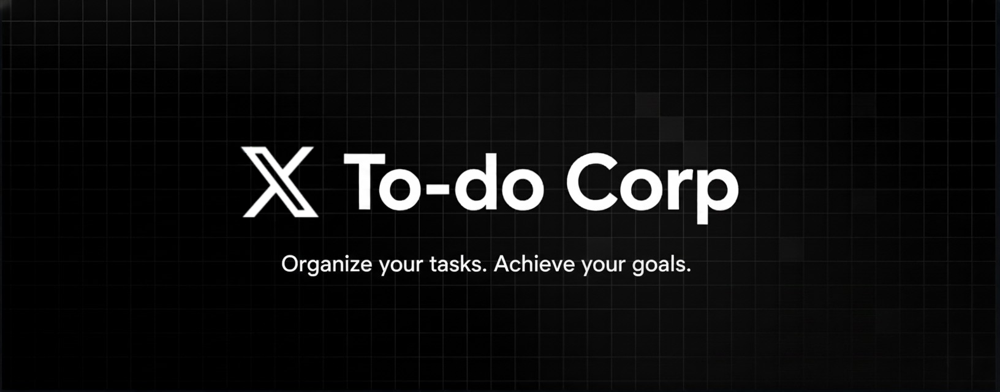
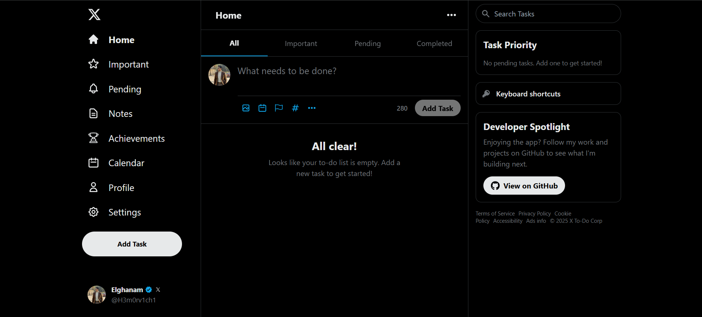

# X To-Do Corp 🚀

<div align="center">
  
  
  ### A Modern, Feature-Rich Task Management Application
  
  [](https://www.typescriptlang.org/)
  [](https://reactjs.org/)
  [](https://vitejs.dev/)
  [](https://tailwindcss.com/)
  
  [Features](#features) • [Demo](#demo) • [Installation](#installation) • [Usage](#usage) • [Tech Stack](#tech-stack) • [Contributing](#contributing)
</div>

---

## 📋 Overview

**X To-Do Corp** is a powerful, Twitter/X-inspired task management application that combines elegant design with robust functionality. Built with modern web technologies, it offers a seamless experience for managing tasks, notes, and tracking productivity.

## ✨ Features

### 🎯 Core Functionality
- **Smart Task Management** - Create, edit, and organize tasks with ease
- **Subtasks & Checklists** - Break down complex tasks into manageable steps
- **Priority Levels** - High, Medium, Low priority with visual indicators
- **Due Dates & Reminders** - Never miss a deadline with smart notifications
- **Recurring Tasks** - Daily, weekly, monthly task automation
- **Tags & Categories** - Organize tasks with custom tags and colors

### 📝 Notes System
- **Rich Note Editor** - Create and manage detailed notes
- **Markdown Support** - Format your notes with markdown syntax
- **Pin Important Notes** - Keep critical information at the top
- **Search & Filter** - Quickly find any note or task

### 🏆 Gamification
- **Achievement System** - Unlock 20+ achievements
- **Productivity Stats** - Track your progress over time
- **Contribution Graph** - GitHub-style activity visualization
- **Spotlight Achievements** - Showcase your accomplishments

### 🎨 Customization
- **Light & Dark Mode** - Easy on the eyes, day or night
- **6 Accent Colors** - Sky, Pink, Green, Orange, Purple, Yellow
- **Responsive Design** - Perfect on desktop, tablet, and mobile
- **Theme Preview** - See changes before applying

### ⏱️ Focus Mode
- **Pomodoro Timer** - 25/5 minute work/break cycles
- **Custom Sessions** - Set your own focus durations
- **Ambient Sounds** - Rain, Cafe, Forest backgrounds
- **Task-Specific Focus** - Link focus sessions to tasks

### 📊 Advanced Features
- **Calendar View** - Visualize tasks by date
- **Data Export/Import** - Backup and restore your data
- **Offline Support** - Works without internet using IndexedDB
- **Keyboard Shortcuts** - Power user productivity
- **Image Attachments** - Add visual context to tasks

## 🎬 Demo

### Live Preview

[](https://x-to-do-corp.pages.dev/)
 
Visit the live app: https://x-to-do-corp.pages.dev/
### Try It Yourself

```bash
# Clone and run locally
git clone https://github.com/H3m0rv1ch1/x-to-do-corp.git
cd x-to-do-corp
npm install
npm run dev
```

Visit `http://localhost:3000` to see the app in action!

## 🚀 Installation

### Prerequisites
- Node.js 16+ and npm/yarn
- Modern web browser (Chrome, Firefox, Safari, Edge)

### Quick Start

```bash
# Clone the repository
git clone https://github.com/H3m0rv1ch1/x-to-do-corp.git

# Navigate to project directory
cd x-to-do-corp

# Install dependencies
npm install

# Start development server
npm run dev
```

### Build for Production

```bash
# Create optimized production build
npm run build

# Preview production build
npm run preview
```

### Desktop App (Windows/macOS/Linux)

```bash
# Run desktop app in development
npm run tauri:dev

# Build desktop app (.exe for Windows)
npm run tauri:build
```

The built executable will be in `src-tauri/target/release/bundle/`

## 📱 Usage

### Creating Your First Task

1. Click the **"Add Task"** button or press `A` or `N`
2. Type your task description
3. Optionally add:
   - 📅 Due date
   - 🏴 Priority level
   - 🏷️ Tags
   - 📎 Image attachment
   - ✅ Subtasks
4. Press **"Add Task"** to save

### Keyboard Shortcuts

| Shortcut | Action |
|----------|--------|
| `A` or `N` | Add new task |
| `H` | Go to Home |
| `P` | Go to Profile |
| `C` | Go to Calendar |
| `O` | Go to Notes |
| `S` | Go to Settings |
| `/` | Focus search |
| `?` | Show shortcuts |
| `Esc` | Close modals |

### Focus Mode

1. Click the play icon on any task
2. Set your focus duration
3. Choose ambient sound (optional)
4. Click **"Start Focus"**
5. Stay focused until the timer completes!

## 🛠️ Tech Stack

### Frontend
- **React 19** - UI library with latest features
- **TypeScript** - Type-safe development
- **Vite** - Lightning-fast build tool
- **TailwindCSS** - Utility-first styling
- **Tauri** - Desktop app framework (Rust + WebView)

### State Management
- **React Context API** - Global state management
- **Custom Hooks** - Reusable logic

### Data Persistence
- **Dexie.js** - IndexedDB wrapper for offline storage
- **LocalStorage** - Theme and preferences

### Additional Libraries
- **React Icons** - Beautiful icon set
- **date-fns** - Date manipulation (if used)

## 📁 Project Structure

```
x-to-do-corp/
├── src/
│   ├── components/
│   │   ├── calendar/      # Calendar and contribution graph
│   │   ├── layout/        # Header, sidebars, navigation
│   │   ├── modals/        # Modal dialogs
│   │   ├── notes/         # Notes functionality
│   │   ├── profile/       # Profile and achievements
│   │   ├── settings/      # Settings components
│   │   ├── todo/          # Task management
│   │   └── ui/            # Reusable UI components
│   ├── contexts/          # React Context providers
│   ├── hooks/             # Custom React hooks
│   ├── services/          # Database and API services
│   ├── types/             # TypeScript type definitions
│   ├── utils/             # Utility functions
│   ├── constants/         # App constants
│   └── assets/            # Static assets
├── src-tauri/             # Tauri desktop app (Rust)
├── public/                # Public assets
├── index.html             # HTML entry point
└── package.json           # Dependencies
```

## 🎨 Design Philosophy

X To-Do Corp follows a **Twitter/X-inspired design language** with:
- Clean, minimalist interface
- Smooth animations and transitions
- Intuitive user interactions
- Consistent spacing and typography
- Accessible color contrasts

## 🔒 Privacy & Data

- **100% Local** - All data stored on your device
- **No Tracking** - Zero analytics or tracking scripts
- **No Account Required** - Start using immediately
- **Export Anytime** - Your data, your control

## 🚢 Deployment

### Web (Cloudflare Pages)
The app is configured for Cloudflare Pages deployment. Push to main branch to auto-deploy.

### Desktop Releases
Desktop installers are built automatically via GitHub Actions when you create a release tag:
```bash
git tag v1.0.0
git push origin v1.0.0
```

## 🤝 Contributing

Contributions are welcome! Please follow these steps:

1. Fork the repository
2. Create a feature branch (`git checkout -b feature/AmazingFeature`)
3. Commit your changes (`git commit -m 'Add some AmazingFeature'`)
4. Push to the branch (`git push origin feature/AmazingFeature`)
5. Open a Pull Request

### Development Guidelines

- Follow the existing code style
- Write meaningful commit messages
- Add comments for complex logic
- Test your changes thoroughly
- Update documentation as needed

## 📝 License

This project is licensed under the MIT License - see the [LICENSE](LICENSE) file for details.

## 🙏 Acknowledgments

- Inspired by Twitter/X's elegant UI design
- Icons from [React Icons](https://react-icons.github.io/react-icons/)
- Built with love and ☕

## 📧 Contact

**Project Maintainer** - [@H3m0rv1ch1](https://github.com/H3m0rv1ch1)

**Email** - moham8ed.atef.23@gmial.com

**Project Link** - [https://github.com/H3m0rv1ch1/x-to-do-corp](https://github.com/H3m0rv1ch1/x-to-do-corp)

---

<div align="center">
  Made with ❤️ by developers, for developers
  
  ⭐ Star this repo if you find it helpful!
</div>
